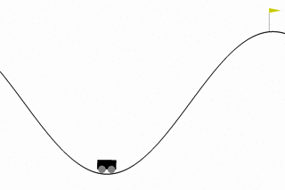

# Summary

This is a generic codebase built for reinforcement learning (RL) research in [TensorFlow](https://tensorflow.org), with popular RL agents pre-implemented as well as integration with [OpenAI Gym](https://gym.openai.com/) environment focusing on quick prototyping and deployment.

Example for recorded envrionment on various RL agents.

| MountainCar-v0 |  Pendulum-v0 | VideoPinball-v0 | Tennis-v0 |
|---|---|---|---|
|||

# Functionality

The following is a list of implemented features in the RL codebase.
- Agents `hparams.agent`
  - Deep Q Networks (DQN)
  - Noisy DQN
  - Vanilla Policy Gradient
  - Deep Deterministic Policy Gradient (DDPG)
  - Proximal Policy Optimization (PPO)
- Memory `hparams.memory`
  - Simple random sampling
  - Proportional Prioritized Experience Replay
- OpenAI Gym integration `--env`
  - support both `Discrete` and `Box` environments
  - Render `--render` and record `--record_video` environment replay
- Model-free asynchronous training  `--num_workers`
- Modularized hyper-parameters setting `--hparams` and [hparams/defaults.py](rl/hparams/defaults.py)
- Modularized action functions [action functions](rl/agents/algos/action_function/basic.py)
- Modularized gradient update functions [compute gradient](rl/agents/algos/compute_gradient/basic.py)
- TensorBoard summary `tensorboard --logdir <output_dir>`

# References
