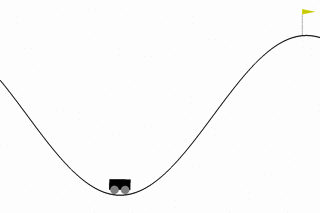
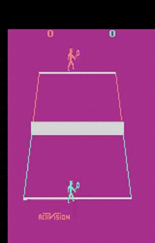

## [FOR.ai](https://for.ai) Reinforcement Learning Codebase [](https://travis-ci.org/for-ai/rl)
Modular codebase for reinforcement learning models training, testing and visualization.

**Contributors**: [Bryan M. Li](https://github.com/bryanlimy), [Alexander Cowen-Rivers](https://github.com/alexanderimanicowenrivers), [Piotr Kozakowski](https://github.com/koz4k), [David Tao](https://github.com/taodav), [Siddhartha Rao Kamalakara](https://github.com/srk97), [Nitarshan Rajkumar](https://github.com/nitarshan), [Hariharan Sezhiyan](https://github.com/hsezhiyan), [Sourav Singh](https://github.com/souravsingh), [Aidan N. Gomez](https://github.com/aidangomez)

### Features
- Agents: [DQN](rl/agents/algos/dqn.py), [Vanilla Policy Gradient](rl/agents/algos/vanilla_pg.py), [DDPG](rl/agents/algos/ddpg.py), [PPO](rl/agents/algos/ppo.py)
- Environments:
  - OpenAI [Gym](https://github.com/openai/gym)
    - support both `Discrete` and `Box` environments
    - render (`--render`) and save (`--record_video`) environment replay
  - OpenAI [CoinRun](https://github.com/openai/coinrun)
- Model-free asynchronous training  (`--num_workers`)
- Memory replay: [Simple](rl/memory/simple.py), [Proportional Prioritized Experience Replay](rl/memory/prioritized.py)
- Modularized
    - [hyper-parameters setting](rl/hparams/defaults.py) (`--hparams`)
    - [action functions](rl/agents/algos/action_function/basic.py))
    - [compute gradient functions](rl/agents/algos/compute_gradient/basic.py)
    - [advantage estimation](rl/agents/algos/advantage_estimator/basic.py)
    - [learning rate schemes](rl/utils/lr_schemes.py)

Example for recorded envrionment on various RL agents.

| MountainCar-v0 |  Pendulum-v0 | VideoPinball-v0 | Tennis-v0 |
|---|---|---|---|
|||

### Requirements
It is recommended to install the codebase in a virtual environment ([virtualenv](https://pypi.org/project/virtualenv/) or [conda](https://conda.io/en/latest/)). 

### Quick install
Configure `use_gpu` and (if on OSX) `mac_package_manager` (either [macports](https://www.macports.org) or [homebrew](https://brew.sh)) params in `setup.sh`, then run it as
```bash
sh setup.sh
```

### Manual setup
You need to install the following for your system:

- [TensorFlow](https://www.tensorflow.org/install)
- [OpenAI Gym](https://gym.openai.com/docs/#installation)
    - Atari `pip install 'gym[atari]'`
- [OpenAI CoinRun](https://github.com/openai/coinrun)
- [FFmpeg](https://ffmpeg.org/download.html)
- Additional python packages `pip install -r ../requirements.txt`

### Quick Start
```
# start training
python train.py --sys ... --hparams ... --output_dir ...
# run tensorboard
tensorboard --logdir ...
# test agnet
python train.py --sys ... --hparams ... --output_dir ... --training False --render True
```

### Hyper-parameters
Check [init_flags()](https://github.com/for-ai/rl/blob/master/train.py#L17), [defaults.py](rl/hparams/defaults.py) for default hyper-parameters, and check [hparams/dqn.py](rl/hparams/dqn.py) agent specific hyper-parameters examples.
- `hparams`: Which hparams to use, defined under [rl/hparams](rl/hparams)
- `sys`: Which system environment to use.
- `env`: Which RL environment to use.
- `output_dir`: The directory for model checkpoints and TensorBoard summary.
- `train_steps`:, Number of steps to train the agent.
- `test_episodes`: Number of episodes to test the agent.
- `eval_episodes`: Number of episodes to evaluate the agent.
- `training`: train or test agent.
- `copies`: Number of independent training/testing runs to do.
- `render`: Render game play.
- `record_video`: Record game play.
- `num_workers`, number of workers.

### Contributing
We'd love to accept your contributions to this project. Please feel free to open an issue, or submit a pull request as necessary. Contact us [team@for.ai](mailto:team@for.ai) for potential collaborations and joining [FOR.ai](https://for.ai).
